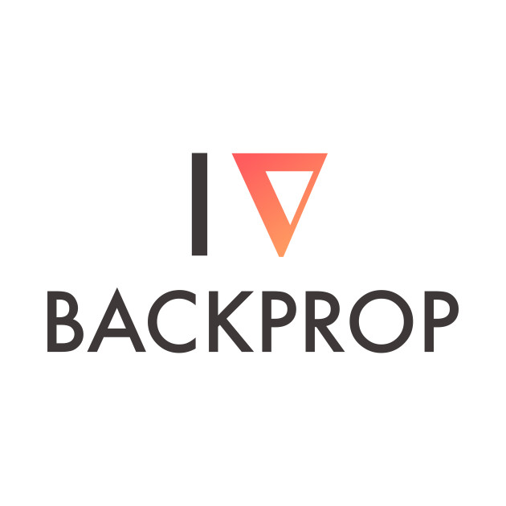

This GitHub repository will be used to host project files and data science resources.

# Projects

## The LEGO Project 

- [Exploring 67 years of LEGO](projects/Exploring_67_years_of_LEGO/lego.html)

## Pivot Tables from Ads Data

- [Pivot Tables from Ads Data](projects/Pivot_tables_from_Ads_data/ad-data-to-pivot-table.html)

# Resources

## Backpropagation with equations  

- [backprop calculation with equations](backprop_with_equations/Backprop_explained_with_mathjax.html) 

## Backpropagation using matrices 

- [backprop calcuation using matrices in markdown](https://github.com/baronrogers5/data-science/blob/master/backprop_using_matrices/backprop.md)

