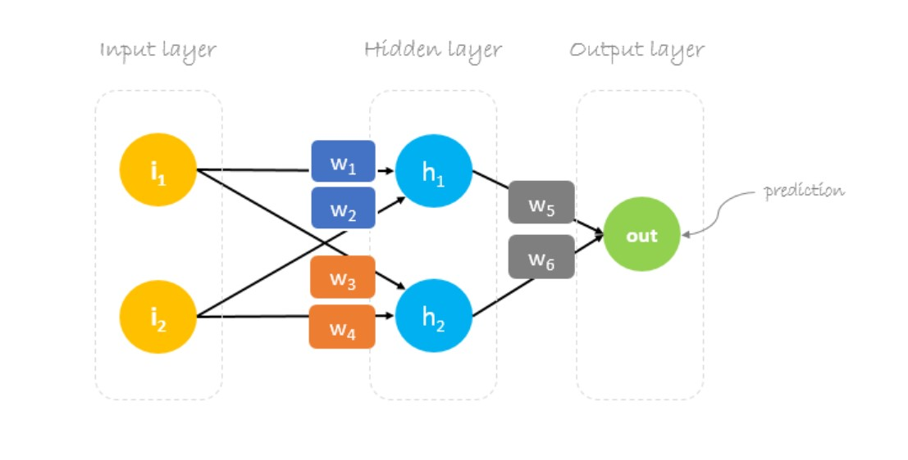

This GitHub repository will be used to host project files and data science resources.

## Projects

- [Exploring 67 years of LEGO](projects/Exploring_67_years_of_LEGO/lego.html)

- Pivot Tables from Ads Data

## Resources

- backprop calcuation using matrices in markdown

- [backprop calculation with equations](backprop_with_equations/Backprop_explained_with_mathjax.html) 
